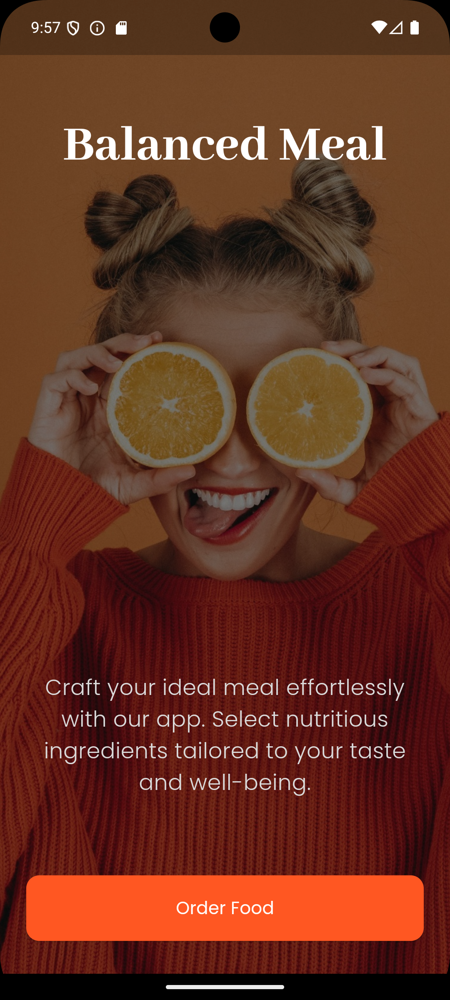
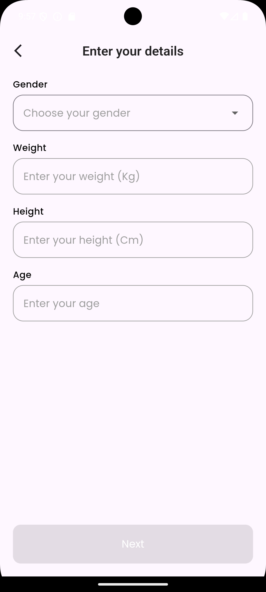
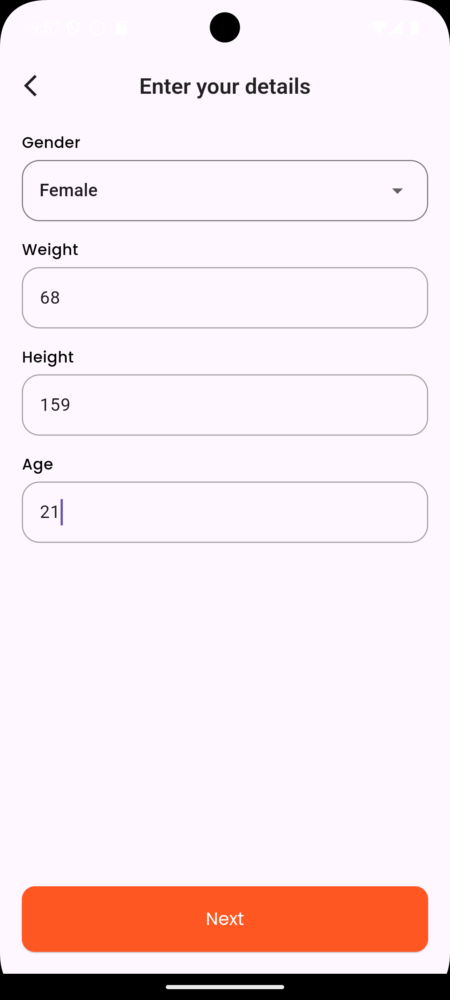
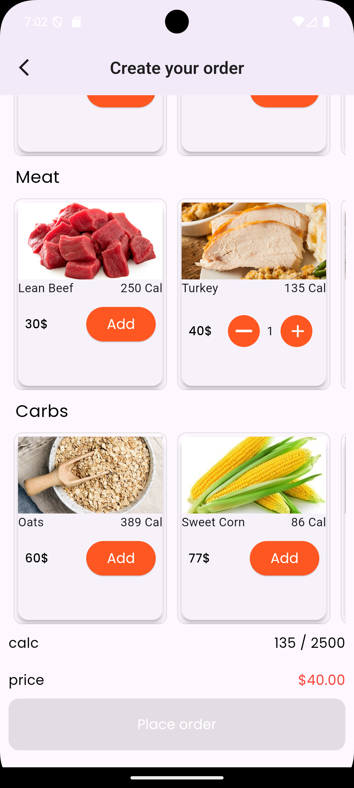
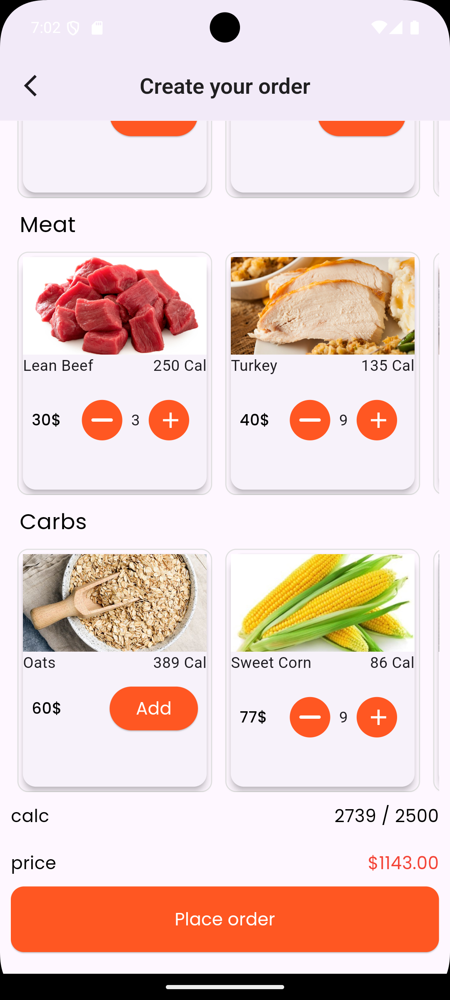
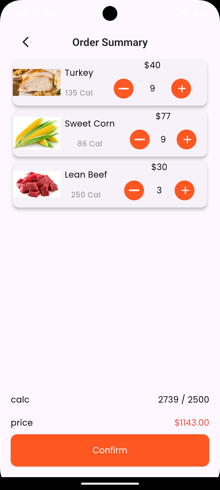
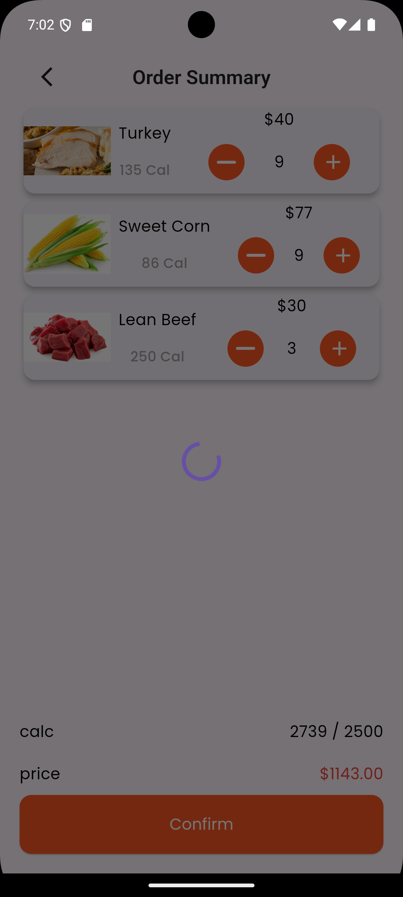
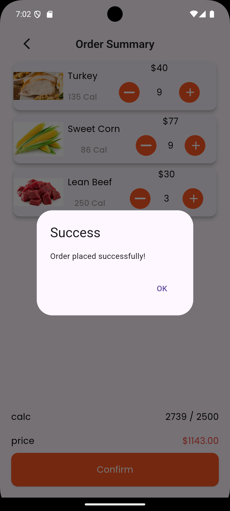

<body> 

  
  
  
  
  
  
  
  
  

  

  

  <h2>Overview</h2>
  

    Balanced Meal is a mobile application developed as part of an assessment task for 
    <strong>Red Software Development</strong>. 
    The app was initially built using <strong>FlutterFlow</strong>, then fully converted to native <strong>Flutter</strong> for better customization and control.  
    It implements a clean architecture based on <strong>MVVM (Model-View-ViewModel)</strong>.
  

  <h2>Features</h2>
  <ul>
    <li>Collects user data such as weight, height, gender, and daily activity level.</li>
    <li>Accurately calculates daily calorie requirements.</li>
    <li>Displays balanced meal options suitable for the user’s calorie needs.</li>
    <li>Tracks calorie consumption progress with a circular indicator.</li>
    <li>Allows confirming meal orders and sending data to an external API.</li>
  </ul>

  <h2>Architecture</h2>
  
The app is structured using the <strong>MVVM</strong> pattern for better code organization:

  <ul>
    <li><strong>Model:</strong> Defines data models such as user data and meals.</li>
    <li><strong>View:</strong> UI screens and widgets that display data and interact with the user.</li>
    <li><strong>ViewModel:</strong> Business logic layer that connects the View and Model, handles data fetching and state management.</li>
  </ul>

  <h2>Technologies Used</h2>
  <ul>
    <li>Flutter (Dart)</li>
    <li>Firebase Firestore (for meal data management)</li>
    <li>Bloc (Cubit) for state management</li>
    <li>REST API (for order confirmation)</li>
    <li>MVVM Architecture</li>
  </ul>

  <h2>Project Structure (Summary)</h2>
  <pre>
lib/
├── models/            # Data model definitions
├── view/              # UI screens and widgets
├── view_model/        # Cubit and business logic
├── services/          # API and Firebase services
└── utils/             # Helper utilities
  </pre>

  <h2>How to Run</h2>
  <ol>
    <li>Ensure Flutter SDK is installed on your machine.</li>
    <li>Clone the repository: 
      <code>git clone https://github.com/username/balanced_meal_app.git</code></li>
    <li>Navigate to the project folder: 
      <code>cd balanced_meal_app</code></li>
    <li>Install dependencies: 
      <code>flutter pub get</code></li>
    <li>Run the app: 
      <code>flutter run</code></li>
  </ol>

  <h2>Contact</h2>
  

    For any inquiries, feel free to reach out: 
    Email: <a href="mailto:tokaahmed34567@gmail.com">tokaahmed34567@gmail.com</a> 
  

</body>
</html>
